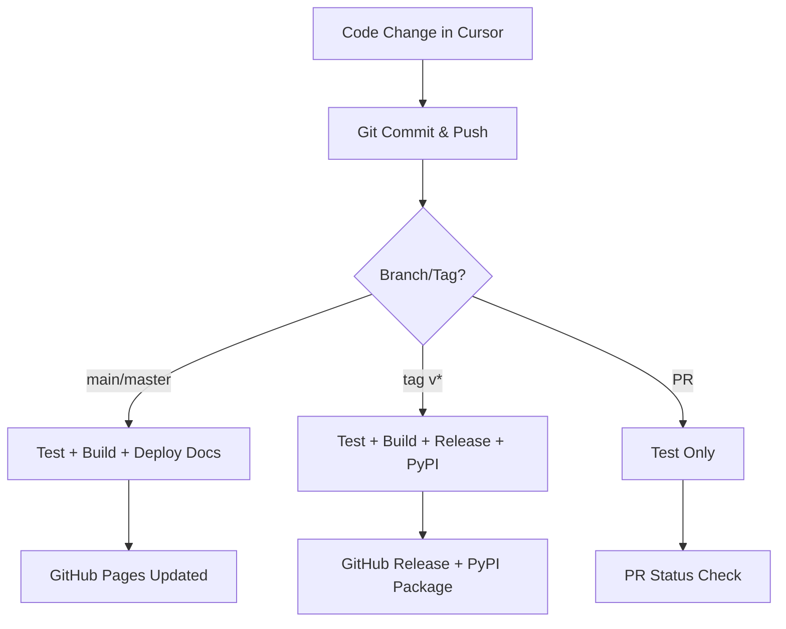

# OmniAvatar Deployment System Summary

## 📁 Files Created

This deployment system consists of the following files:

### Core Deployment Files

| File | Purpose | Type |
|------|---------|------|
| `.github/workflows/deploy.yml` | GitHub Actions CI/CD workflow | Automation |
| `deploy.sh` | Local deployment script | Script |
| `DEPLOYMENT_RULES.md` | Comprehensive deployment guide | Documentation |
| `setup-github.md` | GitHub repository setup guide | Documentation |
| `.gitignore` | Git ignore rules for deployment artifacts | Configuration |

## 🚀 Quick Start

1. **Set up GitHub repository** (follow `setup-github.md`)
2. **Push changes to trigger deployment**:
   ```bash
   git add .
   git commit -m "Add deployment system"
   git push origin main
   ```
3. **Monitor workflow** in GitHub Actions tab

## 🔄 Deployment Flow



## ⚙️ Features

- ✅ **Automated Testing**: Python import validation and linting
- ✅ **Package Building**: Automatic Python package creation
- ✅ **Documentation**: Auto-generated docs deployed to GitHub Pages
- ✅ **PyPI Publishing**: Automatic package publishing for releases
- ✅ **GitHub Releases**: Automatic release creation for tags
- ✅ **Local Deployment**: Script for manual/local deployment
- ✅ **Artifact Storage**: Build artifacts stored for download

## 🛠️ Usage Examples

### Regular Development
```bash
# Make changes in Cursor, then:
git add .
git commit -m "Feature: Add new functionality"
git push origin main
# → Triggers test + build + docs deployment
```

### Creating a Release
```bash
git tag v1.0.0
git push origin v1.0.0
# → Triggers full deployment including PyPI
```

### Local Testing
```bash
./deploy.sh --test        # Run tests only
./deploy.sh --build       # Build package
./deploy.sh               # Full local deployment
```

## 📊 Deployment Targets

| Target | URL/Location | Trigger |
|--------|-------------|---------|
| **Documentation** | `https://polarpointretail-oss.github.io/OmniAvatar` | Push to main |
| **PyPI Package** | `https://pypi.org/project/omni-avatar/` | Git tags |
| **GitHub Releases** | Repository releases page | Git tags |
| **Build Artifacts** | GitHub Actions artifacts | All builds |

## 🔧 Configuration Required

1. **GitHub Secrets** (in repository settings):
   - `PYPI_API_TOKEN`: For PyPI deployment

2. **GitHub Pages** (in repository settings):
   - Source: GitHub Actions

3. **Repository Permissions** (in repository settings):
   - Actions: Read and write permissions

## 📋 Maintenance

### Regular Tasks
- Monitor GitHub Actions for failures
- Update dependencies in `requirements.txt`
- Review and update documentation
- Test package installation from PyPI

### Version Management
- Use semantic versioning: `v1.2.3`
- Update version in setup.py for releases
- Maintain changelog for releases
- Test deployment before tagging

## 🆘 Troubleshooting

### Quick Checks
1. **Workflow fails**: Check Actions tab for logs
2. **PyPI fails**: Verify token and version increment
3. **Docs fail**: Check markdown syntax and mkdocs config
4. **Local fails**: Ensure script is executable and git is clean

### Common Solutions
```bash
# Make script executable
chmod +x deploy.sh

# Check workflow status
# Go to GitHub → Actions tab

# Test locally first
./deploy.sh --test

# Verify git status
git status
```

## 📞 Support

For issues or questions:
1. Check `DEPLOYMENT_RULES.md` for detailed guidance
2. Review GitHub Actions logs in repository
3. Test deployment locally with `deploy.sh`
4. Verify GitHub repository configuration

---

**Repository**: https://github.com/polarpointretail-oss/OmniAvatar
**Documentation**: https://polarpointretail-oss.github.io/OmniAvatar
**Package**: https://pypi.org/project/omni-avatar/

Your OmniAvatar project is now ready for automated deployment! 🎉